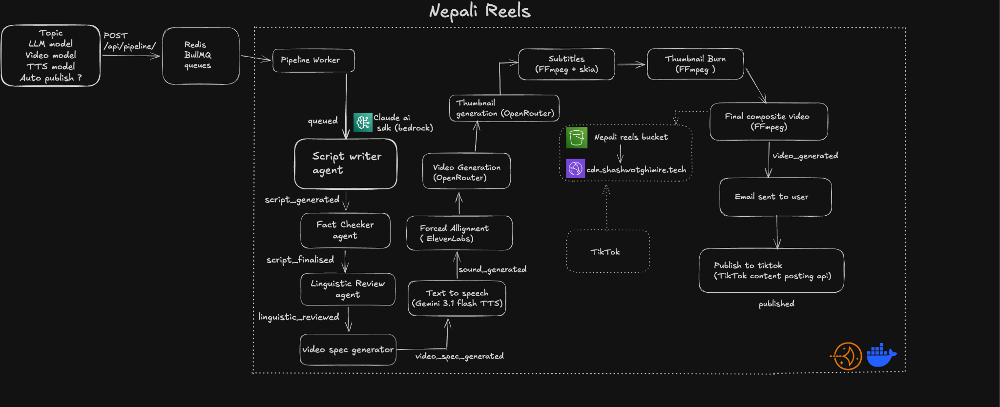

# nepali-reels

AI pipeline that turns a topic into a published Nepali short-form video on TikTok.

---

## Architecture



---

## Stack

| Layer | Tech |
|---|---|
| Backend | Node 22, Express 5, TypeScript |
| Database | PostgreSQL (Neon) via Sequelize 6 |
| Jobs | BullMQ 5 + Redis |
| LLM | Claude via AWS Bedrock |
| TTS | `gemini-3.1-flash-tts-preview` (voice: Aoede) |
| Video alignment | ElevenLabs forced alignment |
| AI video gen | OpenRouter (Seedance 1.5 Pro / Wan 2.6 / Grok) |
| Media | FFmpeg + skia-canvas (Devanagari subtitle rendering) |
| Storage | AWS S3 + CloudFront |
| Auth | better-auth (Google OAuth) |
| Frontend | React 19, Vite 8, shadcn/ui, TanStack Query 5 |
| Deploy | Docker Compose → VPS via GitHub Actions |

---

## Services

Three Docker containers:

- **api** — HTTP server on port 8000
- **worker** — BullMQ workers (pipeline, tiktok, analytics, email) + weekly cron
- **web** — nginx serving the React SPA

---

## Pipeline Stages

The existing workflow is versioned as `explainer` v1. Business outputs remain on the `reels` row for API compatibility, while stage attempts, leases, replay outputs, budget reservations, and durable media artifacts have dedicated tables. Create and retry jobs use the same dispatcher. A retry reuses successful checkpoints and completed scene artifacts.

```
script → fact_check → linguistic_review → video_spec → audio → alignment
       → video scenes → thumbnail → render → upload → notify → publish
```

Provider resource budgets are reserved before calls and include in-flight work. Missing usage retains reserved capacity. These limits do not represent a guaranteed USD spend while prices or provider usage remain unknown.

Subtitle rendering uses skia-canvas instead of FFmpeg's `drawtext` for correct Devanagari glyph shaping. Caption timings are proportionally scaled from ElevenLabs word timestamps to match actual TTS audio duration.

---

## Analytics

Weekly cron (Monday 9am UTC) runs a per-user Claude analysis of TikTok metrics, producing an engagement report and a list of suggested topics for the next week.

---

## Dev Setup

```bash
cp api/.env.example api/.env   # fill in credentials
docker compose up
```

API: `http://localhost:8000`  
Web: `http://localhost:5173`
